# s3vault

[](https://github.com/jstdlee/s3vault/actions/workflows/build-release.yml)
[](https://github.com/jstdlee/s3vault/releases)
[](LICENSE)

Sync, browse and encrypt your files on **any S3-compatible storage**: Cloudflare R2, AWS S3, MinIO, Backblaze B2, Wasabi and others.

- **Encryption:** each file can be encrypted with standard OpenPGP, using the `gpg` you already have.
- **Built-in viewing and editing:** everything happens inside the app, so decrypted content is never written to disk and never handed to another program.
- **Conflicts:** they are never resolved silently. You review them grouped by folder and apply one decision to many files at once.

Linux desktop app (C++17 · Dear ImGui · GLFW · OpenGL 3.3) plus a headless `s3vault-cli`. macOS, Windows, iOS and Android are on the [roadmap](#roadmap).

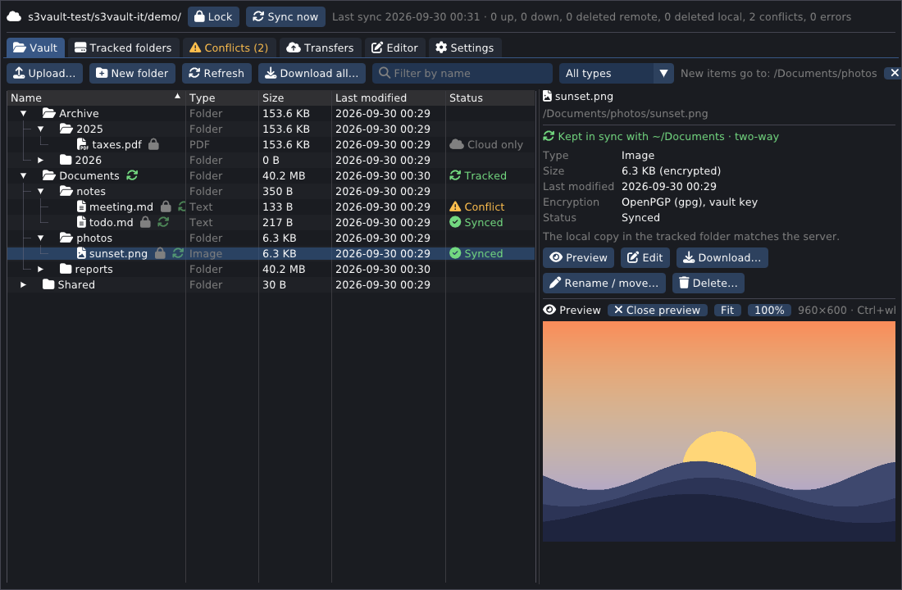

## Contents

[Features](#features) · [Gallery](#gallery) · [How sync works](#how-sync-works) · [Security](#security) ·
[Build](#build) · [Set up](#set-up-cloudflare-r2-example) · [CLI](#cli) · [Tests](#tests) · [Source layout](#source-layout) ·
[Roadmap](#roadmap) · [License](#license)

## Features

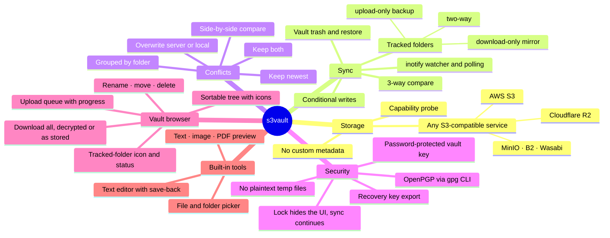

- **Tracked folders.** Keep a local folder in sync with a vault folder:
  - Modes: **two-way**, **upload-only** (backup: local deletions and server-only files are never pulled down), or **download-only** (mirror).
  - Changes are picked up by inotify, with a periodic rescan as a safety net, and the server is polled every 60 s.
  - A `.s3vaultignore` file (gitignore syntax) excludes files.
- **Vault browser.**
  - A folder tree with type icons, sortable by name, type, size, last modified and status. Filter by name or type.
  - A green sync icon marks tracked folders and their files. Hovering shows the local path and direction, and every status explains itself.
  - Click a selected row again, click empty space, or press Esc to deselect. The **vault root** button resets where new items go.
- **File operations.**
  - Upload with the built-in file browser (multi-select, folders included) or by drag and drop.
  - Uploads show as a **queue with progress** in Transfers, and every result is logged.
  - New folder (with an editable parent folder), **rename / move** (server-side copy, nothing re-uploaded), and **delete** to the vault trash, then restore.
  - Buttons in the details pane, plus F2 and Delete keys.
- **Download all.** One click copies the whole vault to a new dated folder:
  - **decrypted:** plain files, or
  - **as stored:** encrypted `.gpg` files plus `.s3vault/key.gpg`, so the copy stays protected and opens later with your password.
- **Built-in viewer and editor.**
  - Previews for text/code, images (png/jpg/gif/bmp/tga/psd) and PDF (page by page; poppler reads it from a pipe).
  - A text editor (Editor tab, Ctrl+S) that saves back to the vault.
  - Everything stays in memory, and there is no "open with".
- **Password, lock and keys.**
  - New passwords need at least 14 characters and must pass a strength check; there is a generator.
  - **Lock**, manually or after N idle minutes, hides the window. The vault key stays loaded, so **sync keeps running**.
  - **Forget vault key** stops encrypted sync.
  - **Export** the password-protected key file, or the raw recovery key.
- **Robust UI.**
  - Network, crypto and tree building run on worker threads; syncing hundreds of MB keeps every frame under 100 ms.
  - If the GPU driver can't open a window (e.g. an LLM is using all unified memory), s3vault restarts itself with software rendering.

## Gallery

| | |
|---|---|
|  **Vault tree + image preview.** The tracked folder has a sync icon and statuses. | 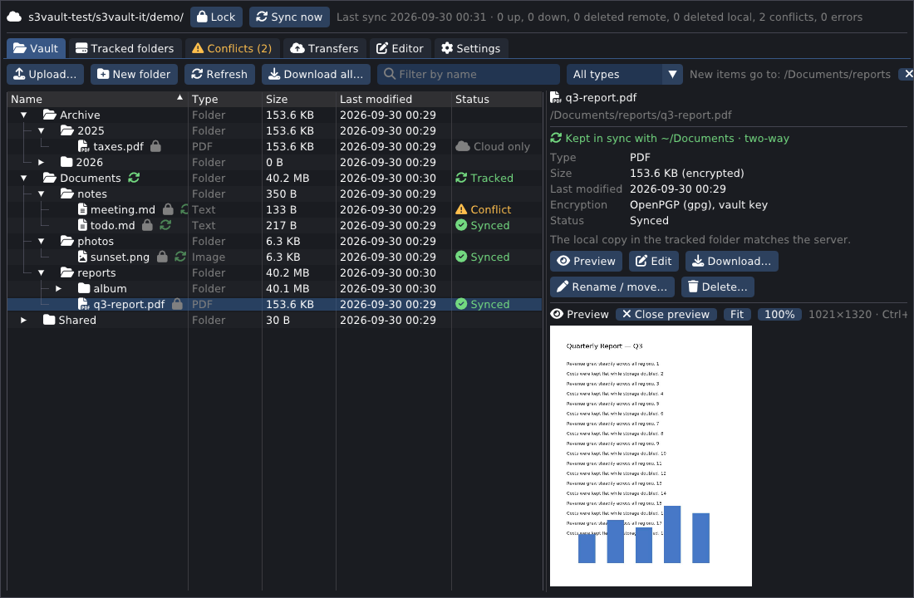 **PDF preview**, rendered page by page from memory. |
| 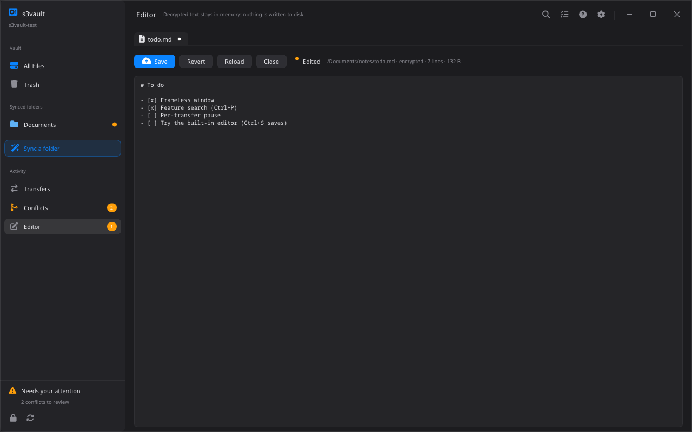 **Built-in editor.** The tab dot means unsaved; Ctrl+S saves back with If-Match. | 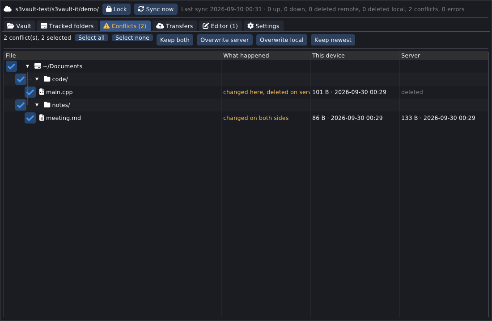 **Conflicts** grouped by tracked folder → folder → file, with batch actions. |
| 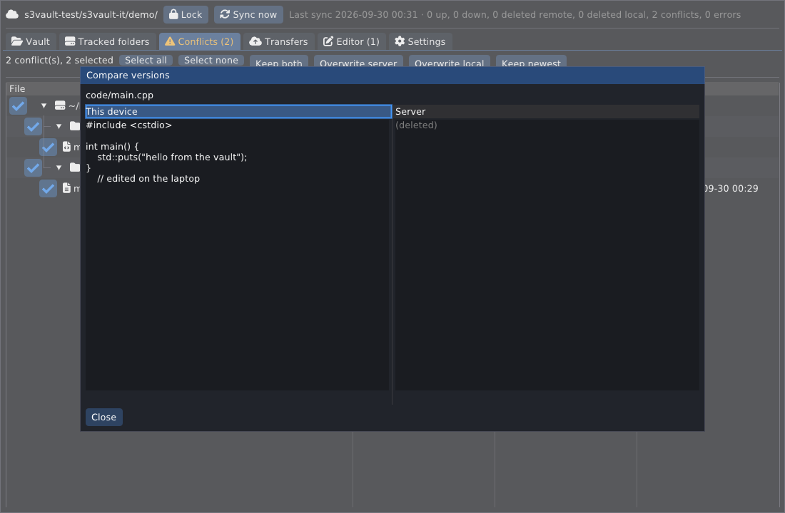 **Compare** this device's version with the server's. | 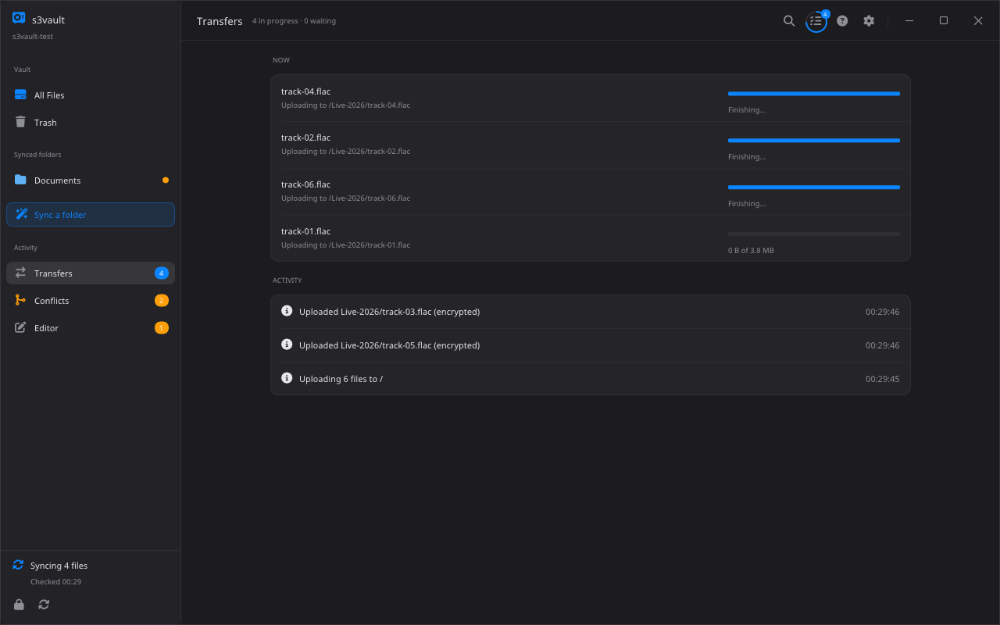 **Transfers**: upload queue with progress, plus the activity log. |
| 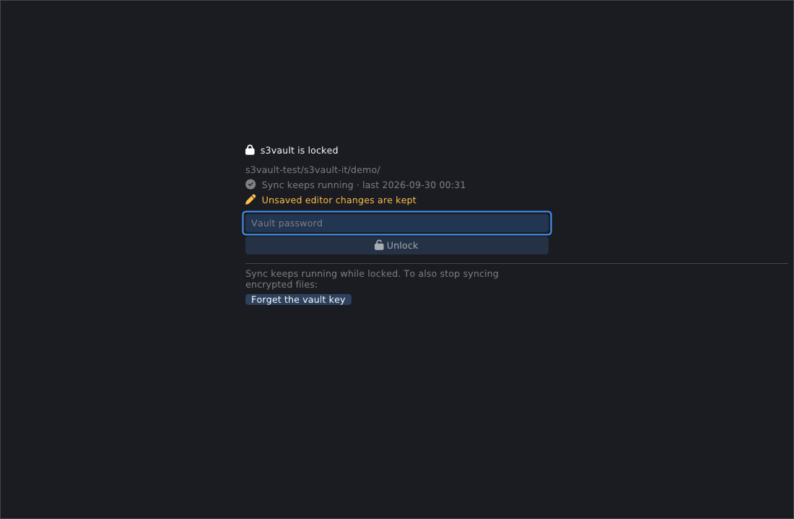 **Lock screen.** Content is hidden while sync keeps running. | 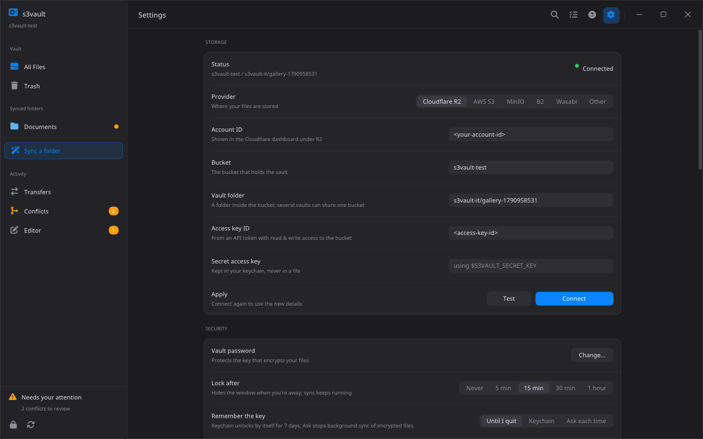 **Settings**: storage, keys & backup, download all. |
| 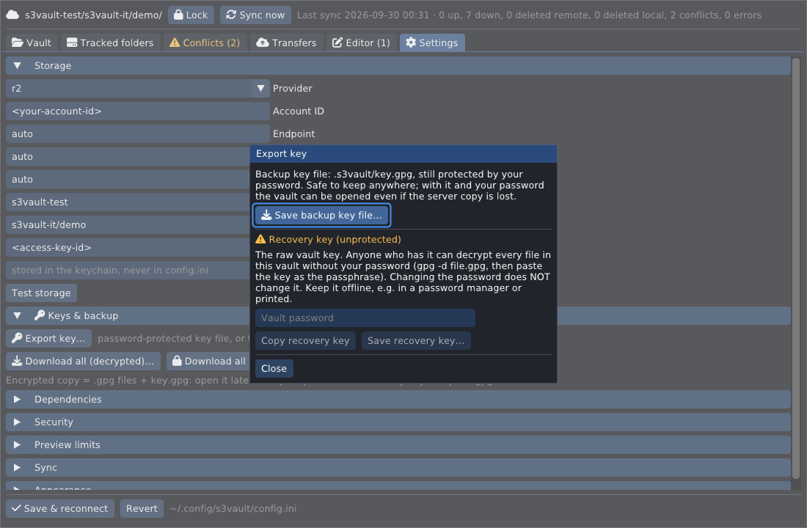 **Export key**: backup key file or recovery key. | 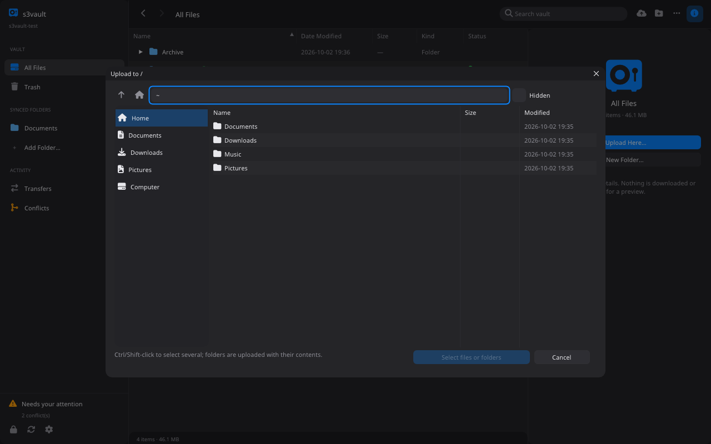 **Built-in file browser** for uploads and tracked folders. |

## How sync works

### Why not a CRDT

A CRDT merges concurrent edits automatically, which fits structured data (text documents, JSON). Files in a vault are opaque, and most are encrypted, so there is nothing meaningful to merge.

s3vault therefore uses a **per-file 3-way compare** plus the storage service's own **compare-and-swap** (conditional writes). The result has the same property you want from a CRDT, *no edit is ever lost*, but anything that can't be merged safely is surfaced as a conflict for you to decide.

For every file, the local index remembers a **base**: the server's ETag and the plaintext SHA-256 from the last successful sync. Each pass compares **local**, **server** and **base**:

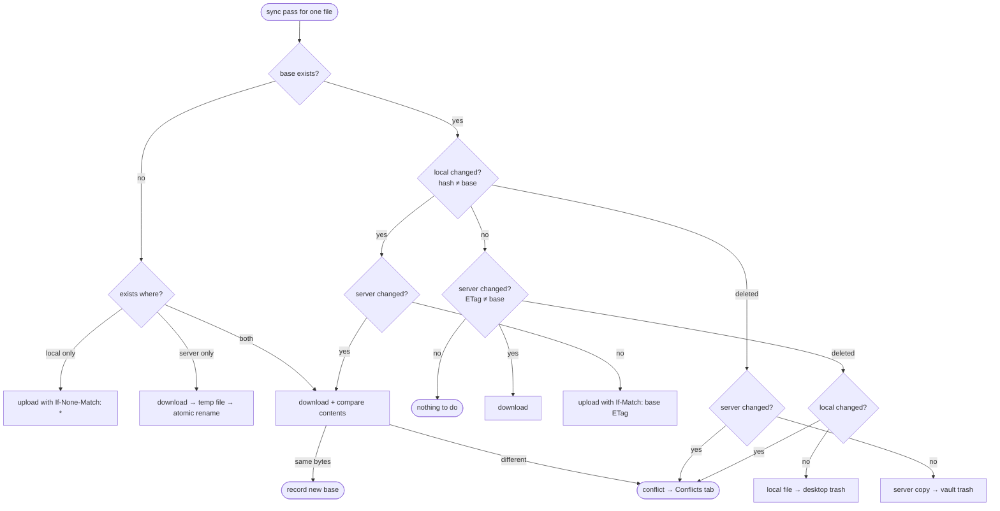

The direction of a tracked folder filters these actions:
- **upload-only** never downloads, and never deletes on the server because of a local deletion.
- **download-only** never uploads.

### Single sync pass

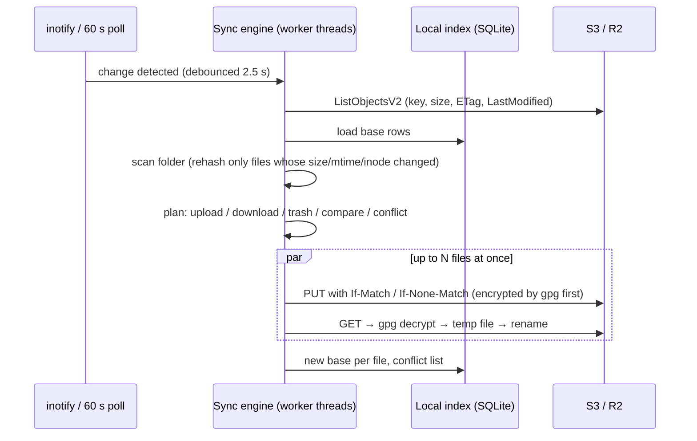

### Overwrite protection: conflict interception

Two devices edit the same file at the same moment. Both saw ETag `e1`, and each uploads with `If-Match: e1`. The storage accepts exactly one:

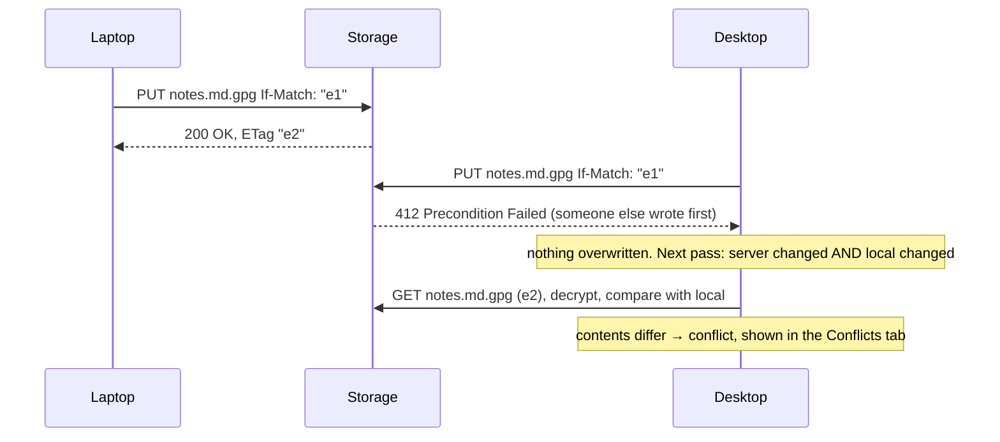

In the **Conflicts** tab you pick a resolution for one file or a whole folder. Every resolution is again a conditional write, so a third concurrent change is caught as well:

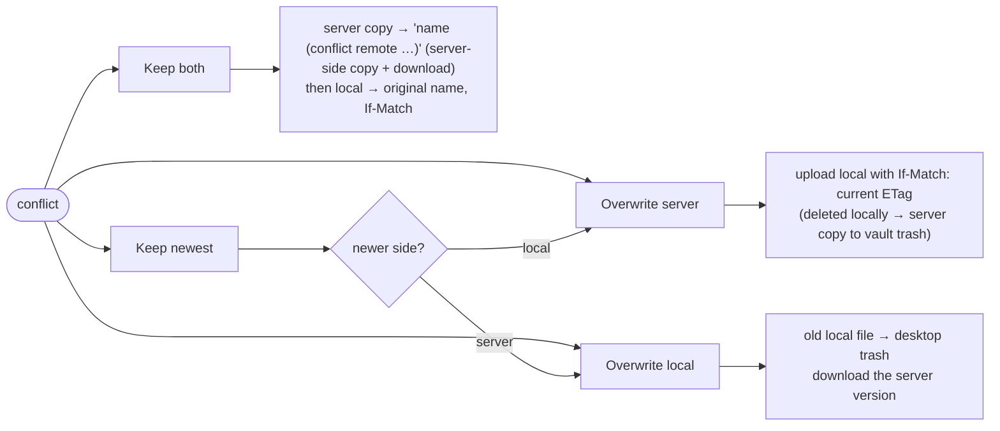

The built-in editor uses the same rule. Saving uploads with `If-Match` on the version you opened. If someone changed the file meanwhile, you choose **Keep both / Overwrite server / Reload server version**.

## Security

### Keys and passwords

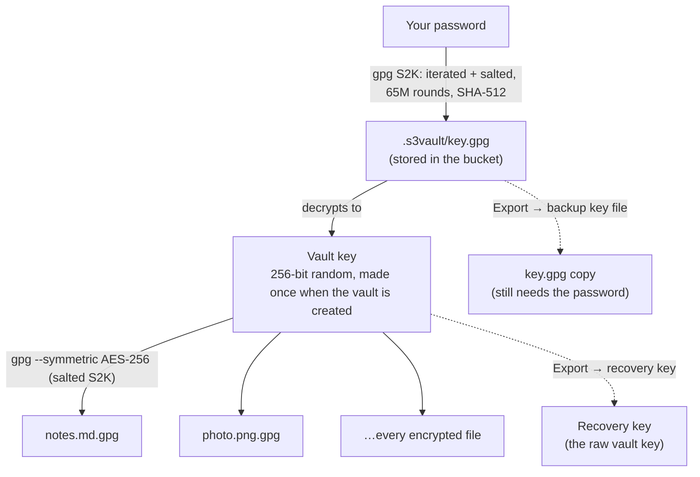

**Encryption with gpg**
- Every encrypted file is a standard OpenPGP message (SKESK v4 + SEIPD, AES-256) produced by your installed `gpg`.
- It is not a custom format. You can always decrypt without s3vault:
  ```bash
  gpg -d key.gpg              # enter your password → prints "s3vault-key-v1" and the vault key
  gpg -d notes.md.gpg         # enter the vault key as the passphrase
  ```
- The passphrase reaches gpg only through file descriptor 3. It is never on the command line, in the environment or in a file, and `--no-symkey-cache` keeps gpg-agent from caching it.
- s3vault accepts a decryption only if gpg reports `DECRYPTION_OKAY` plus an integrity check (`GOODMDC` or AEAD). A tampered object, or an unencrypted OpenPGP "literal" packet planted in place of a `.gpg` file, is rejected.

**Password and vault key**
- Your password protects only `key.gpg`, with slow, deliberate key stretching.
- Files are encrypted with the random vault key inside it. That makes per-file overhead ~4 ms instead of ~150 ms.
- **Changing the password re-encrypts only `key.gpg`**; no file is touched. The vault key, and so the recovery key, stays the same.
- New passwords need at least 14 characters and must pass a strength check (character classes, repeats, common words, keyboard/alphabet runs). The generator makes about 120-bit passwords.
- The unlocked vault key lives only in locked (non-swappable) memory and is wiped on quit or **Forget vault key**.
- **Lock** hides the window behind the password screen but keeps the key loaded, so background sync of encrypted files continues. Unlocking checks the password offline against the cached `key.gpg`.
- Remember options: lock the window after N idle minutes (default, 15), keep until quit, keychain for N days, or ask every time. "Ask every time" means no background sync of encrypted files.

**Backup key file vs recovery key** (Settings → Keys & backup)

| | Backup key file | Recovery key |
|---|---|---|
| What it is | a copy of `key.gpg` | the raw vault key |
| Protected by | your password | nothing: whoever has it can decrypt every file |
| Use it when | the server copy of `key.gpg` is lost or damaged | you forgot the password |
| Changes when the password changes | yes (export again) | no |
| Keep it | anywhere | offline: a password manager or printed |

Exporting the recovery key asks for the password again, and the file is written with mode 600.

**What the storage provider sees**
- File and folder names, sizes, timestamps and the ciphertext. Names are visible by design, so the vault can be listed without the key.
- A malicious provider could swap two encrypted files of the same vault, or serve an older version. Per-file encryption without a signed index cannot detect that. Integrity of each file *is* checked.
- The S3 secret key is stored in the desktop keychain (libsecret), or read from `S3VAULT_SECRET_KEY`. It never goes in `config.ini`.

**No plaintext left behind**
- Previews, PDF rendering and the editor work in memory, and their buffers are wiped when closed.
- Decrypted data reaches your disk only through what you ask for: **Download**, **Download all (decrypted)**, and syncing into your tracked folders.
- Tracked-folder downloads go to a temp file next to the target and are renamed into place only after decryption and integrity checks succeed.

## Download

Prebuilt Linux binaries (x86_64 and arm64) are on the [Releases](https://github.com/jstdlee/s3vault/releases) page:
- **Versioned releases** come from `v*` tags.
- **Nightly** is rebuilt on every push to `main` by the [build and release](.github/workflows/build-release.yml) workflow, which compiles, runs the unit tests, packages and publishes.

```bash
tar xzf s3vault-*-linux-$(uname -m | sed 's/aarch64/arm64/').tar.gz
cd s3vault-*/ && ./bin/s3vault          # GUI;  ./bin/s3vault-cli --help
```

## Build

```bash
./build.sh
```

**What `build.sh` does**
- Fetches pinned sources into `third_party/`: ImGui, GLFW, stb, pugixml, the SQLite amalgamation, curl headers and Font Awesome.
- If the X11/GL `-dev` headers are missing, fetches them without root.
- Builds `build/s3vault`, `build/s3vault-cli` and the tests.

**Runtime**
- libcurl and libsecret are loaded at runtime, so the build needs no `-dev` packages.
- Needs `libcurl4`, `gnupg` ≥ 2.2, and optionally `poppler-utils` (PDF preview) and a Secret Service keyring.
- `--software` forces CPU rendering.

Install to `~/.local`:
```bash
cmake --install build --prefix ~/.local
```

## Set up (Cloudflare R2 example)

1. Create a bucket and an R2 API token with **Object Read & Write** scoped to that bucket, in the Cloudflare dashboard under R2 → Manage API tokens.
2. In the app, open **Settings → Storage**: provider `r2`, account ID, bucket, access key ID and secret. Then **Save & reconnect**, and s3vault offers to create the vault. Or use the CLI:
   ```bash
   s3vault-cli config set storage.provider r2
   s3vault-cli config set storage.account_id <account id>
   s3vault-cli config set storage.bucket <bucket>
   s3vault-cli config set storage.access_key_id <key id>
   s3vault-cli secret set            # paste the secret; stored in the keychain
   s3vault-cli probe                 # auth, conditional writes, copy, multipart
   s3vault-cli init                  # choose the vault password
   s3vault-cli add-root ~/Documents --remote Documents
   s3vault-cli sync                  # or: s3vault-cli watch / the GUI
   ```

**Other providers:** set `storage.provider` to `aws`, `b2`, `wasabi`, `minio` or `custom`, plus `storage.region`, and `storage.endpoint` for MinIO or custom. `storage.addressing` (`path` or `virtual`) overrides the default.

**Where things are stored**
- Configuration: `~/.config/s3vault/config.ini` (never contains secrets).
- Index: `~/.local/share/s3vault/index.db`.
- `S3VAULT_HOME=<dir>` moves both.

## CLI

```
s3vault-cli --help
  config show|get|set · secret set · deps · probe [--multipart]
  init · passwd · lock · gen-password · export-key <file> [--recovery]
  roots · add-root <dir> [--remote P] [--direction D] [--plain] · rm-root · pause · resume
  sync · watch
  ls [dir] [--sort name|type|size|modified] [--reverse] [-r]
  put <file> [vault-path] [--plain|--encrypt] [--overwrite] · get · cat · mkdir · mv · rm
  trash · restore <n> · purge [days]
  conflicts · resolve <id|all> keep-local|keep-remote|keep-both|keep-newest
```

## Tests

```bash
build/s3vault-tests            # unit tests: SHA-256/HMAC, SigV4 reference vector, planner decision table,
                               # ignore rules, password strength, gpg round trip / wrong key / tamper / planted packet
tests/r2_integration.sh        # end to end against a real bucket, two simulated devices (see its header for test.env)
```

**What the integration test covers**
- the storage probe, including multipart
- vault init and wrong-password rejection
- sync in both directions, deletes going to the trash
- both-modified and modify/delete conflicts, and their resolution
- concurrent writers
- CLI file operations
- tamper rejection and password change
- a 70 MiB multipart file, plain folders

**GUI smoke tests**
```bash
s3vault --software --script "sleep:3;unlock;idle;expand:Docs;select:Docs/a.png;preview;idle;shot:a.png;quit"
```
- Script runs use an invisible window.
- On exit, they report the slowest UI frame.

## Source layout

```
core/        portable engine, no UI: util, config, store (S3/SigV4), crypto (gpg), secret, index (SQLite),
             vault, sync (planner + engine), preview, edit (in-memory documents)
platform/    iface/platform.h + one backend per OS (linux implemented; macos, windows, ios, android reserved)
app/ui       ImGui panels shared by desktop builds;  app/desktop  GLFW main;  app/mobile  reserved (Flutter)
cli/         s3vault-cli
tests/       unit tests, R2 integration script, test helper
docs/        screenshots
```

## Roadmap

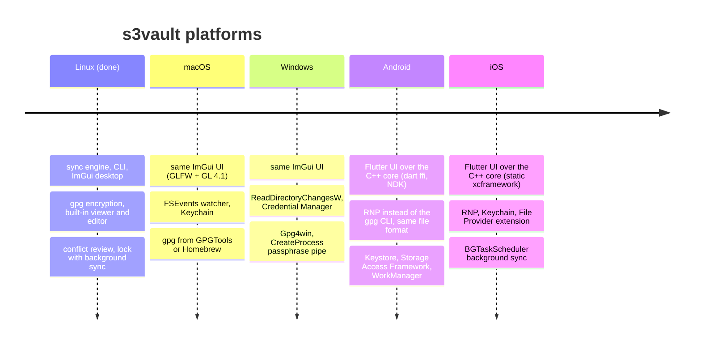

| Platform | Status | UI | Watch / background | Secrets | Crypto |
|---|---|---|---|---|---|
| Linux | ✅ done | ImGui + GLFW/GL3 | inotify + polling | libsecret | gpg CLI |
| macOS | planned | same ImGui code | FSEvents | Keychain | gpg (GPGTools/Homebrew) |
| Windows | planned | same ImGui code | ReadDirectoryChangesW | Credential Manager | Gpg4win |
| Android | planned | Flutter over the C++ core (`dart:ffi`) | WorkManager, SAF folders | Android Keystore | RNP (OpenPGP library) |
| iOS | planned | Flutter over the C++ core | BGTaskScheduler, File Provider | Keychain | RNP |

**Shared across platforms**
- **File format:** all platforms read and write the same OpenPGP files, so a vault created on Linux opens on a phone.
- **Planned per-platform work:** each `platform/<os>/README.md` lists what that port needs.
- **Mobile note:** phones have no gpg command, so the mobile apps will use RNP, which reads and writes the same files. A gpg ↔ RNP cross-test will be part of CI.

## License

s3vault is free software under the **GNU General Public License v3.0** (see [LICENSE](LICENSE)).

Third-party components keep their own licenses:
- Dear ImGui, GLFW, pugixml, stb and SQLite: MIT, zlib, MIT, public domain/MIT and public domain respectively.
- Font Awesome Free: SIL OFL 1.1 font, CC BY 4.0 icons.

These are fetched by `scripts/fetch-deps.sh` and not stored in this repository.
